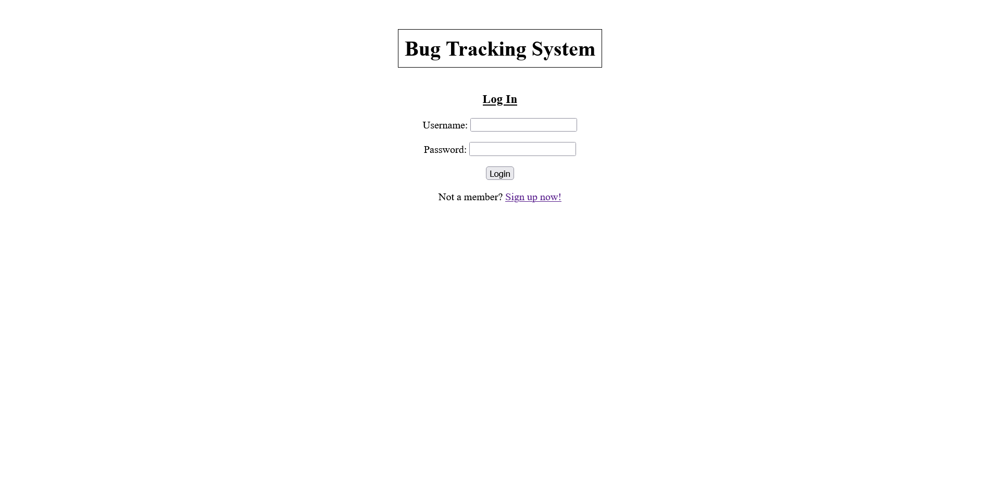
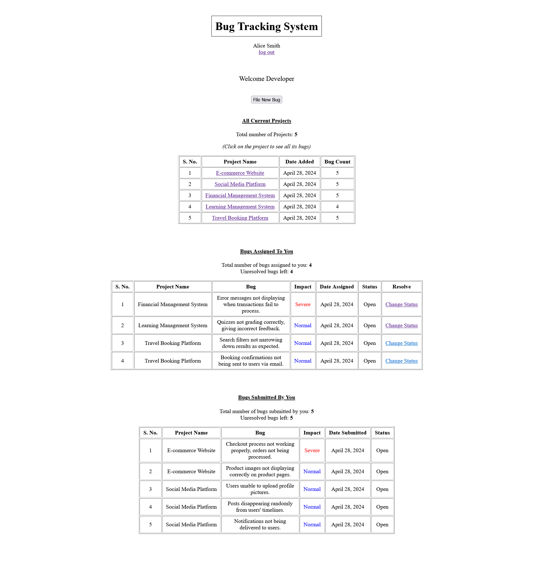
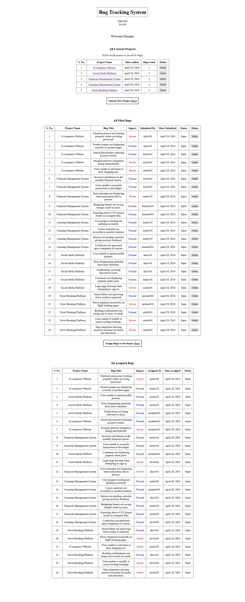

# Bug Tracking System

## Description

This Django project implements an authentication system where users can log in as either a manager or a developer. Based on their role, users are directed to different portals with specific functionalities.

- **Developer Portal**: Developers can file bugs for listed projects, view projects with bug counts, view bugs submitted by them, view bugs assigned to them, and change the status of assigned bugs from open to close.

- **Manager Portal**: Managers can list new projects, view projects with bug counts, assign bugs to developers, view bugs assigned by them, view all bugs filed by developers, and delete projects or bugs as necessary.

The project uses a MySQL database as the default database in Django settings. It includes normalized model classes and a user flow to determine which users have access to specific functionalities. Many other database management systems can also be integrated with this project; more about that can be found here: https://docs.djangoproject.com/en/5.0/topics/install/#database-installation

## Screenshots











## Installation

1. Clone the repository to your local machine.
   ```bash
   git clone https://github.com/paras-gill/Bug-Tracking-System.git
   ```

2. Install Python and Django if not already installed.
   ```bash
   pip install django
   ```

3. Install MySQL and set up the database settings in `settings.py`.
   ```python
   DATABASES = {
       'default': {
           'ENGINE': 'django.db.backends.mysql',
           'NAME': 'your_database_name',
           'USER': 'your_database_user',
           'PASSWORD': 'your_database_password',
           'HOST': 'localhost',
           'PORT': '3306',
       }
   }
   ```

4. Apply migrations to create database tables.
   ```bash
   python manage.py makemigrations
   python manage.py migrate
   ```

## Usage

### Developer Portal

1. Log in as a developer.
2. File bugs for listed projects.
3. View all projects and their bug counts.
4. View bugs submitted by you.
5. View bugs assigned to you and change their status from open to close.

### Manager Portal

1. Log in as a manager.
2. List new projects.
3. View all projects and their bug counts.
4. Assign bugs to developers.
5. View all assigned bugs.
6. View all bugs filed by developers.
7. Delete projects with zero bug counts.
8. Delete bugs whose status has changed from open to close.

## Contributing

1. Fork the repository.
2. Create a new branch.
3. Make your changes.
4. Test your changes thoroughly.
5. Commit your changes and push to your fork.
6. Create a pull request.

## License

This project is licensed under the [MIT License](LICENSE).

## Contact

For any inquiries or support, please contact [paras_gill@outlook.com](mailto:paras_gill@outlook.com).
